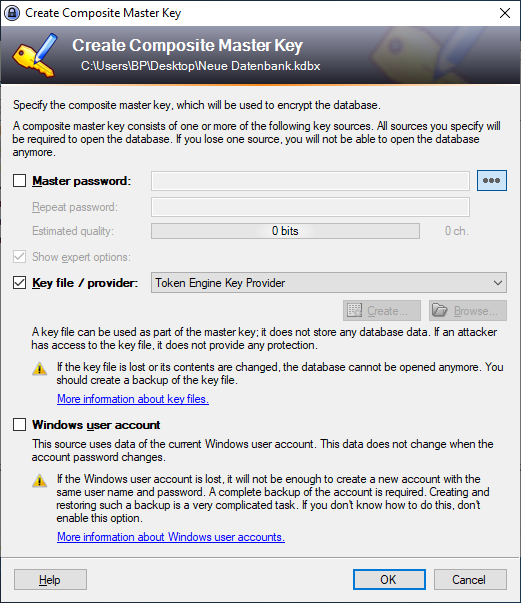
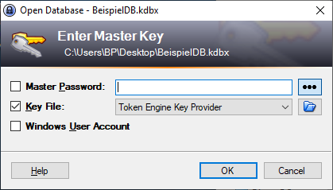
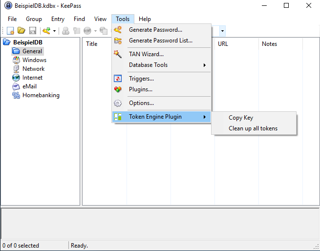

# Token Engine Key Provider

This plugin provides 2 factor authentication to a KeePass database with a token (possession) and the token pin (knowledge).

Using this plugin you can use a token to open a KeePass database with real 2 factor authentication. The token will be accessed by the digitronic Token Engine. Each token you can use with digitronic Token Engine you also can use to open a KeePass database.

Features:
- Secure any new KeePass database with 2 factor authentication
- Clone token key to multiple token

## Installation

### Prerequisites

- digitronic Token Engine

### Installation steps
1. Download [Token Engine Key Provider](https://2-faktor-authentifizierung.de/download/TokenEngineKeePassPlugin.zip)
2. Follow the instructions contains in the archive

## Screenshots
Create a new database with **Token Engine Key Provider**.

Open a database with **Token Engine Key Provider**.

Clone the token key.
